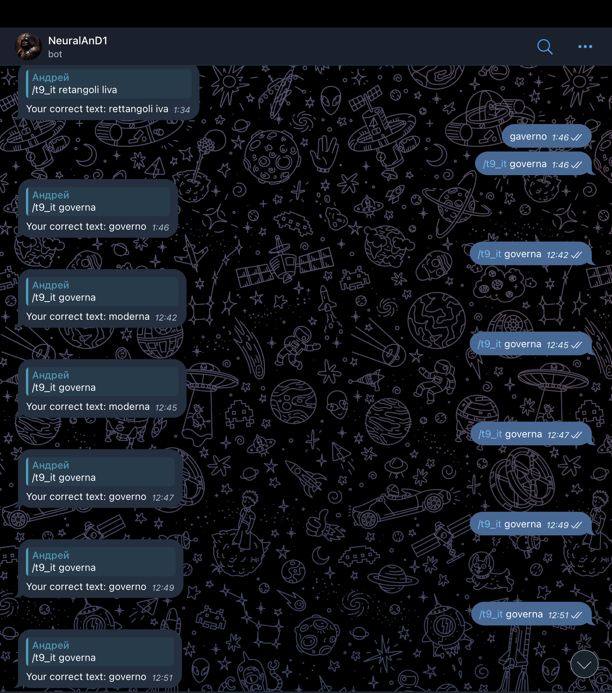

# T9

It is a simple T9 Dictionary/correct spelling model that combines a lot of Machine Learning and Data Analysis algorithms. 
The model was a homework assignment at my university.

Here, you can see the implementation of:
A Markov model (to calculate the probability of corrected spelling and compare them using context).
Levenshtein Damerau distance is used to compare probabilities of different text changes.
Additionally, other simpler NLP algorithms are employed.

Tests are on the screen below (i used Italian language)

